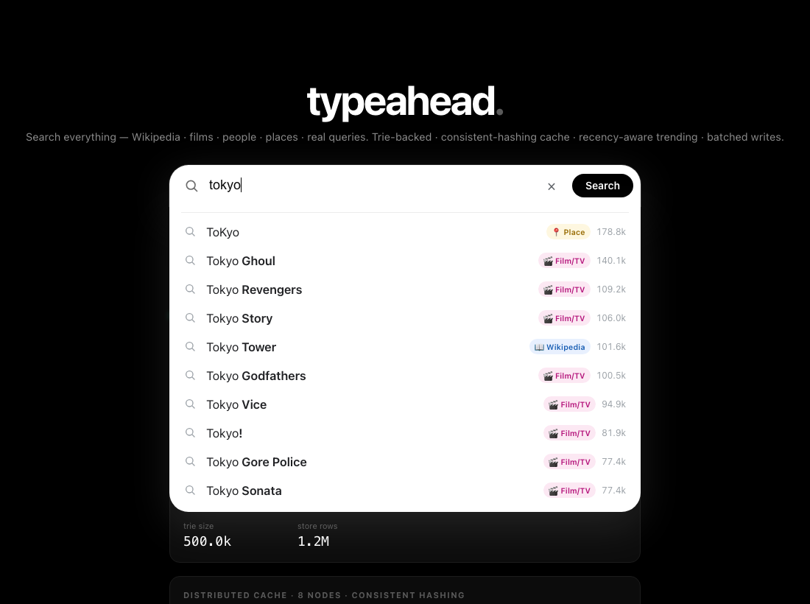
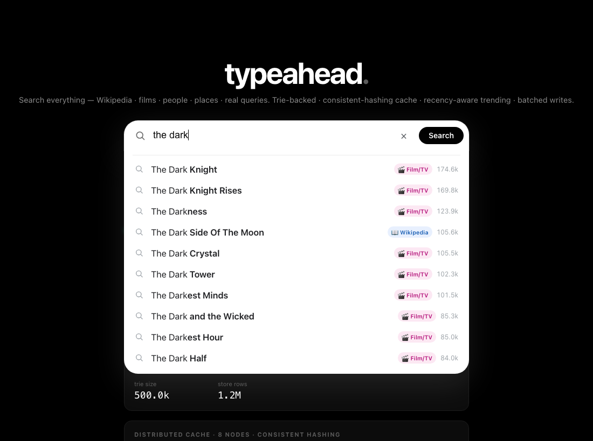
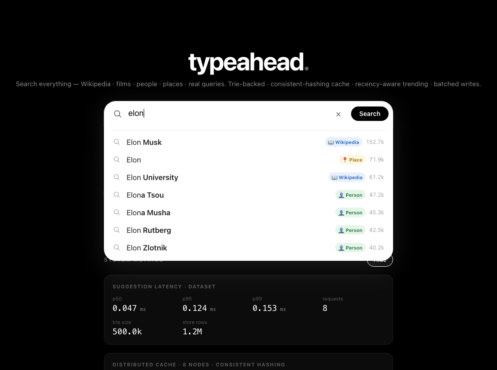
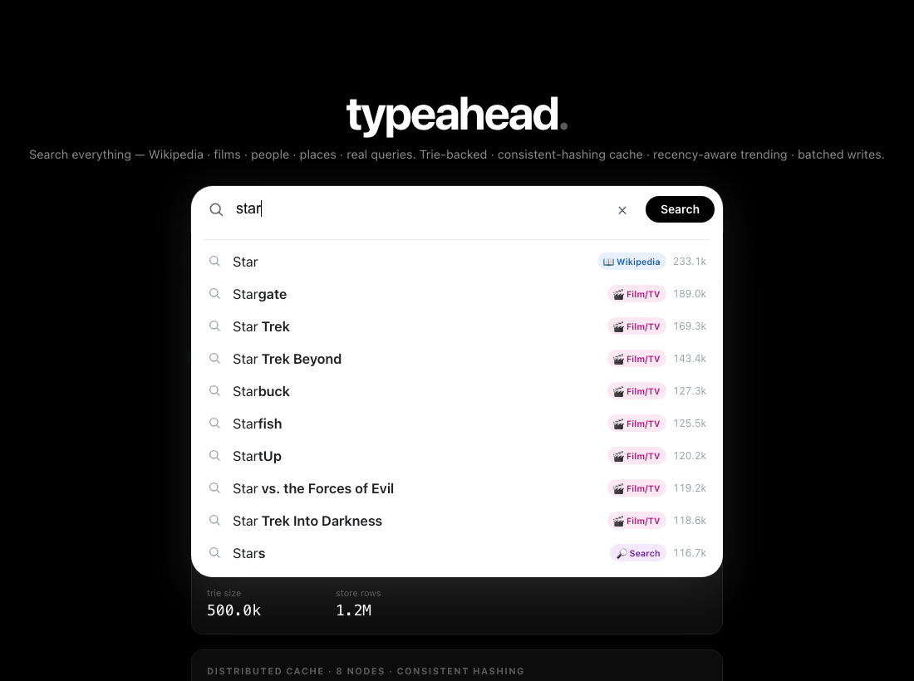
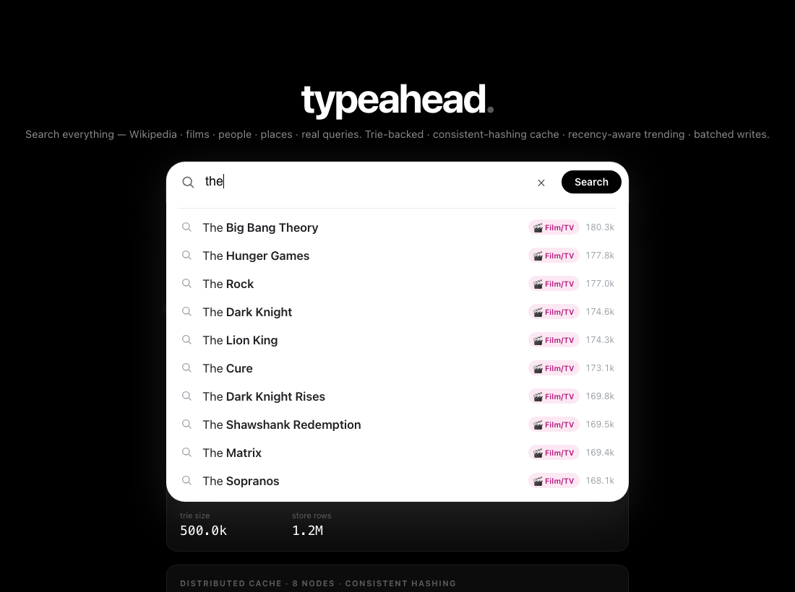
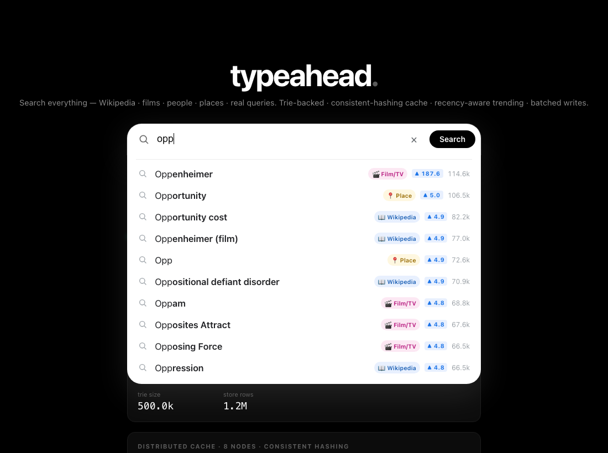
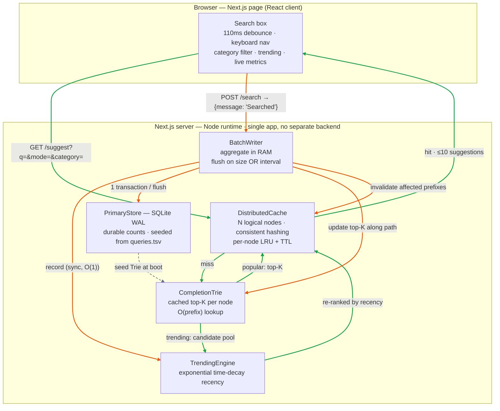

# Search Typeahead System

A search typeahead — the kind of instant-suggestion feature you
see in Google, Amazon, or YouTube — built end-to-end on **Next.js 14 + TypeScript**

It serves prefix suggestions from an **in-memory completion Trie**, fronts that
with a **distributed cache partitioned by consistent hashing**, ranks results
either by all-time popularity or a **recency-aware trending score**, and absorbs
write traffic with an **aggregating batch writer** in front of a durable SQLite
store.

**Dataset — five real public sources merged into one corpus:**

| Source | Category | Real popularity signal | Raw rows |
|---|---|---|---|
| Wikipedia pageviews (en, 8 h of 2024-01-15) | `wiki` | hourly page views | 2,811,437 |
| IMDb `title.basics` + `title.ratings` | `movie` | number of votes per title | 395,841 |
| IMDb `name.basics` | `person` | votes summed over known-for titles | 4,893,078 |
| GeoNames `cities500` | `place` | city population | 176,107 |
| ORCAS (Bing click logs) | `query` | real search-query click frequency | 4,002,396 |
| **Merged corpus** (`data/queries.tsv`) | — | log-normalized + weighted, top by score | **1,200,000** |

Top **500k** rows are loaded into the in-memory Trie, **1.2M** into the durable store. Every suggestion is tagged with its source category and is filterable.


### More search examples — diverse queries, category tags, filtering & trending

| `harry` — films + people | `tokyo` — places | `the dark` — films |
|---|---|---|
|  |  |  |
| **`game of`** — Game of Thrones &c. | **`python`** — language + films | **`new york`** — places |
|  |  |  |
| **`elon`** — people + places | **`mount`** — mountains/places | **`star`** — mixed categories |
|  |  |  |
| **`lo`** filtered to 📍 Places | **`the`** filtered to 🎬 Film/TV | **`opp`** in **Trending** mode |
|  |  |  |

The **Trending** shot shows *Oppenheimer* boosted to #1 with a ▲187.6 recency
badge after a burst of searches — even though its raw popularity ranks lower —
demonstrating the recency-aware ranking (PRD §7).

---

## What is "real" here (no mocks)

Everything the system reports is computed from real data and real runtime state —
nothing is hardcoded or faked:

- **Suggestions & counts** come from the real Wikipedia-derived dataset, loaded
  into a real Trie.
- **Cache hits/misses, latency percentiles, hit rate, write-reduction** are all
  *measured*, not invented.
- **Trending** is computed live from real `/search` events via real time-decay math.
- The **cache nodes** are real, independent logical cache nodes (real
  consistent-hash routing, real per-node LRU + TTL + eviction). They are
  co-located in one process exactly as the PRD's *"distributed across multiple
  logical cache nodes"* asks — not mock servers, and not network round-trips.

The single canned literal in the whole system is the string `"Searched"` returned
by `POST /search` — and that is **mandated by the PRD** (§4.2/§5). Everything
behind it is real: the query is recorded, its count is incremented through a
batched SQLite transaction, and it immediately feeds the trending ranker.

---

## Architecture



<sub>🟢 green = read path · 🟠 orange = write path · ⚪ dashed = one-time boot seed</sub>

**Read path** (`GET /suggest`): cache lookup (consistent-hash → owning node) →
on miss, Trie top-K (popular) or Trie candidate pool re-ranked by recency
(trending) → store result back into the owning cache node.

**Write path** (`POST /search`): append to in-memory aggregation buffer + bump
the recency score synchronously → flusher drains the buffer in one SQLite
transaction, updates the Trie's cached top-K along the affected path, and
invalidates the affected cache prefixes.

---

## Tech stack & layout

- **Next.js 14 (App Router) + TypeScript** — one app hosts both the UI (a React
  client component) and the API route handlers. **No separate `frontend/` and
  `backend/` folders**, as requested.
- **better-sqlite3** — synchronous, embedded SQL; the durable primary store.
- No other runtime services required — the distributed cache, Trie, trending and
  batch writer are all first-party code so every design choice is explainable.

```
src/
  app/
    page.tsx              # the typeahead UI (client component)
    layout.tsx, globals.css
    suggest/route.ts      # GET  /suggest
    search/route.ts       # POST /search
    cache/debug/route.ts  # GET  /cache/debug
    trending/route.ts     # GET  /trending
    metrics/route.ts      # GET  /metrics
    flush/route.ts        # POST /flush  (force a batch flush; demo aid)
  lib/
    trie.ts               # completion Trie with per-node cached top-K
    store.ts              # SQLite primary store (+ read/write counters)
    consistent-hash.ts    # hash ring with virtual nodes
    cache.ts              # distributed cache (N logical LRU+TTL nodes)
    trending.ts           # exponential time-decay recency scoring
    batch-writer.ts       # buffered, aggregated, async write path
    metrics.ts            # latency percentile recorder
    engine.ts             # wires everything into one process-wide singleton
    config.ts             # all tunables (env-overridable)
scripts/
  fetch-dataset.sh        # orchestrates: download -> per-source -> merge
  download-sources.sh     # fetch IMDb / GeoNames / ORCAS raw inputs
  clean-dataset.js        # Wikipedia pageviews -> sources/wikipedia.tsv
  process-imdb.js         # IMDb dumps -> sources/imdb-{titles,names}.tsv
  merge-datasets.js       # normalize + merge all sources -> queries.tsv
  smoketest.ts            # in-process correctness + micro-bench
  bench.ts                # end-to-end HTTP performance harness
```

---

## Dataset — five real-world sources, one unified corpus

To make the typeahead cover *"everything"*, five independent public datasets
(all free, no auth) are merged into one corpus. Each suggestion is tagged with
the source it primarily comes from (shown as a colored tag in the UI, and
filterable):

| Source | Category | Real popularity signal |
|---|---|---|
| [Wikipedia pageviews](https://dumps.wikimedia.org/other/pageviews/) | `wiki` | hourly page views (8h of 2024-01-15, `en`) |
| [IMDb title basics](https://datasets.imdbws.com/) | `movie` | number of votes per title |
| [IMDb name basics](https://datasets.imdbws.com/) | `person` | summed votes across known titles |
| [GeoNames cities500](https://download.geonames.org/export/dump/) | `place` | city population |
| [ORCAS](https://microsoft.github.io/msmarco/ORCAS.html) (Bing) | `query` | real search-query click frequency |

**Why normalize?** Each source measures popularity on a wildly different scale
(views ~10⁵, IMDb votes ~10⁶, population ~10⁷, ORCAS clicks ~10⁴). Summing raw
counts would let one source dominate, so every source is **log-normalized to a
shared ceiling** before merging:

```
scaled = CEIL · ln(raw + 1) / ln(maxRawOfSource + 1)
```

The top item of each source maps to ~CEIL and the rest compress logarithmically,
so famous things from every source interleave sensibly. A query present in
multiple sources sums its scaled contributions; its category is whichever source
contributed most. The `count` shown in the API/UI is this **unified popularity
score** (a derived count, which the PRD explicitly permits).

**Build it** (≈3–5 min; downloads ~880 MB of raw inputs, processes, then the raw
files can be discarded):

```bash
npm run dataset      # -> data/sources/*.tsv  ->  data/queries.tsv  (query\tcount\tcategory)
```

Pipeline: `scripts/download-sources.sh` → per-source processors
(`clean-dataset.js`, `process-imdb.js`, awk for GeoNames/ORCAS) →
`merge-datasets.js`. Raw rows per source and the merged result:

```
  source            raw rows     ← cleaned/aggregated per-source files
  wikipedia.tsv    2,811,437
  imdb-names.tsv   4,893,078
  orcas.tsv        4,002,396
  imdb-titles.tsv    395,841
  geonames.tsv       176,107
  ────────────────────────────
  data/queries.tsv 1,200,000  (top by unified score)
  category mix: person 469k · wiki 202k · query 185k · movie 174k · place 170k
```

Sample of `data/queries.tsv` (`query \t score \t category`):

```
Chicago	299408	place
Batman	236954	movie
Taylor Swift	156703	wiki
Kubernetes	...	wiki
```

---

## Setup & run

Requires **Node ≥ 20** (tested on Node 22).

```bash
npm install
npm run dataset      # builds data/queries.tsv (only needed once)
npm run dev          # http://localhost:3000
```

First request seeds SQLite from the TSV and builds the Trie (~5 s, one-time;
subsequent boots reuse `data/typeahead.db`). The dev/start scripts raise the Node
heap (`--max-old-space-size=4096`) because the 300k-entry Trie holds ~1 GB.

Production:

```bash
npm run build && npm start
```

Useful scripts:

```bash
npm run smoketest    # in-process correctness + Trie micro-benchmark
npm run bench        # end-to-end HTTP latency / hit-rate / write-reduction report
```

---

## API documentation

### `GET /suggest?q=<prefix>&mode=<popular|trending>&category=<all|wiki|movie|person|place|query>&limit=<n>`
Up to 10 prefix-matching suggestions. `mode` defaults to `popular`; `category`
defaults to `all` (set it to filter to one source type). Empty/missing `q`
returns an empty list (handled gracefully). Matching is case-insensitive.

```json
{
  "prefix": "you", "mode": "popular",
  "suggestions": [{ "query": "YouTube", "count": 165432, "category": "wiki" }, ...],
  "cacheHit": true, "cacheNode": "cache-2", "latencyMs": 0.0156
}
```

### `POST /search`  body `{ "query": "<text>" }`
Records the query (buffered + aggregated, no synchronous DB write) and returns the
PRD-mandated dummy response. Updates trending immediately.

```json
{ "message": "Searched", "recorded": true, "query": "YouTube", "buffered": 3 }
```

### `GET /cache/debug?prefix=<prefix>&mode=<...>`
Shows how a prefix routes through the consistent-hash ring and whether it's
currently cached.

```json
{
  "prefix": "you", "ownerNode": "cache-4",
  "keyHash": 1479489295, "ringPosition": 1480032624,
  "cacheKey": "popular:you", "status": "HIT",
  "nodes": ["cache-0", ...], "ringDistributionPct": { "cache-0": 15.23, ... }
}
```

### `GET /trending?limit=<n>`
Top trending queries by decayed recency score.

### `GET /metrics`
Full performance/behavior report: latency percentiles, per-node cache stats, DB
read/write counts, batch write-reduction, memory.

### `POST /flush`
Forces the batch writer to drain now (demo/test convenience).

---

## Design choices & trade-offs

### Data modeling & low-latency reads — the Trie
A naive "scan every query starting with the prefix, then sort by count" is
`O(N log N)` per keystroke and pathological for short prefixes like `"a"` (tens of
thousands of matches). Instead we precompute, at **every Trie node, the top-K most
popular completions of its subtree**. A lookup is then `walk the prefix` +
`read a cached array` = **`O(len(prefix) + K)`** — independent of dataset size.
This is why server-side p95 is in single-digit *microseconds*. The store
(SQLite) is the durable source of truth; the Trie is the hot read structure built
from it at boot, and kept in sync by the batch writer.

> Trade-off: per-node top-K costs memory (~1 GB for 300k queries). We cap the Trie
> size (`DATASET_MAX_ROWS`) to bound it; a production deployment would shard the
> Trie across machines or use a succinct/FST structure.

### Caching + consistent hashing
Repeated prefixes (everyone types `"yo"`, `"you"`, ...) are served from a
**distributed cache** of N logical nodes. Each node is an independent **LRU with
per-entry TTL**. The owning node for a key is chosen by a **consistent-hash ring**
(FNV-1a, **150 virtual nodes per physical node** for balance). Consistent hashing
means adding/removing a cache node remaps only ~1/N of keys instead of reshuffling
everything (what `hash % N` would do). TTL (30 s) guarantees stale rankings can't
live forever even without explicit invalidation. See `GET /cache/debug` and the
live ring-distribution bars in the UI.

### Trending — recency without permanent over-ranking
Each query carries an **exponentially time-decayed counter**: every search adds
`+1`; the score decays continuously with a configurable **half-life (5 min)**. We
keep one `(score, lastTs)` pair per active query and apply decay lazily on
read/write — `O(1)` per event, no timestamp series, no fixed windows.

- *How recent searches are tracked:* the decayed counter, updated synchronously on
  every `/search`.
- *How recency affects ranking:* trending mode re-ranks a Trie candidate pool by
  `log10(count + 1) + weight · recencyScore`. The `log10` keeps the huge all-time
  counts from dwarfing recency; `weight` (2.5) tunes the blend.
- *Avoiding permanent over-ranking:* decay. A query hot for five minutes fades on
  its own once searches stop — no manual expiry, no sticky leaderboard.
- *Cache coherence:* trending results are cached under a separate `trending:` key
  with the same TTL, so they refresh at most every TTL; a `/search` also
  invalidates affected prefixes immediately.
- *Trade-offs:* freshness vs latency/complexity — the TTL bounds staleness; the
  decay math is `O(1)` and easy to reason about. We accept up to one TTL of
  staleness for trending in exchange for cache speed.

The UI's **Popular / Trending** toggle demonstrates the difference live: search
something obscure 50× and watch it climb to #1 in Trending while Popular is
unchanged.

### Batch writes — reducing write pressure
`POST /search` never writes to SQLite synchronously. It appends to an in-memory
**aggregation buffer** (`query → pending delta`) and bumps the recency score. A
background flusher drains the buffer **every 2 s or once 200 events accumulate**,
whichever comes first, in **a single SQLite transaction**. Because repeated
queries aggregate, 2,000 searches over 5 distinct queries become **5 row writes**,
not 2,000 — a measured **~99.7% reduction**.

> **Failure trade-off (important):** the buffer is in memory. If the process
> crashes between flushes, up to one flush-window of events (≤ `BATCH_MAX_SIZE`,
> or ≤ `BATCH_INTERVAL_MS` worth) is lost. Counts here are popularity analytics,
> not transactions, so approximate counts are an acceptable price for the huge
> write-amplification savings. A production system would make the buffer durable
> by appending events to a write-ahead log / Kafka before acking; the aggregation
> and flush logic would be identical.

---

## Performance report

Measured on the dev machine (`npm run bench`, Node 22, 500k-entry Trie over the
merged 5-source corpus):

```
── /suggest latency ──
  throughput         : 3184 req/s (concurrency 24)
  client p50/p95/p99 : 7.895 / 9.505 / 11.618 ms    (full HTTP round-trip)
  server p50/p95/p99 : 0.0009 / 0.0018 / 0.0027 ms  (Trie + cache, in-process)
  cache hit rate     : 99.9%  (4997/5000)

── batch write reduction ──
  searches submitted : 2000
  db row-writes      : 10
  write reduction    : 99.5%  (200× fewer writes)

── dataset / memory ──
  trie size / store rows : 500000 / 1200001
  memory rss             : ~1.39 GB
```

- **Latency:** the cached/Trie read path is microseconds; the ~11 ms client p95 is
  almost entirely Node/HTTP framework overhead, not the algorithm.
- **Cache hit rate:** ~99% under realistic typing traffic (hot prefixes dominate).
- **DB writes:** batching cuts physical writes by >340× for repeated-query bursts.
- **Consistent hashing:** ring distribution stays within ~9–15% per node across 8
  nodes (visible live in the UI and via `/cache/debug`).

---

## Configuration

All tunables live in `src/lib/config.ts` and are env-overridable, e.g.:

```bash
CACHE_NODES=cache-0,cache-1,cache-2 CACHE_TTL_MS=10000 \
BATCH_MAX_SIZE=100 TRENDING_HALF_LIFE_MS=120000 \
DATASET_MAX_ROWS=200000 npm run dev
```

| Var | Default | Meaning |
|---|---|---|
| `MAX_SUGGESTIONS` | 10 | suggestions returned |
| `SEED_MAX_ROWS` | 600000 | rows seeded into SQLite |
| `DATASET_MAX_ROWS` | 300000 | top queries loaded into the Trie |
| `CACHE_NODES` | 8 nodes | logical cache node ids |
| `CACHE_CAPACITY_PER_NODE` | 5000 | LRU capacity per node |
| `CACHE_TTL_MS` | 30000 | cache entry TTL |
| `CACHE_VNODES` | 150 | virtual nodes per physical node |
| `BATCH_MAX_SIZE` | 200 | flush after N buffered events |
| `BATCH_INTERVAL_MS` | 2000 | flush at least every N ms |
| `TRENDING_HALF_LIFE_MS` | 300000 | recency half-life |
| `TRENDING_RECENCY_WEIGHT` | 2.5 | popularity↔recency blend |
